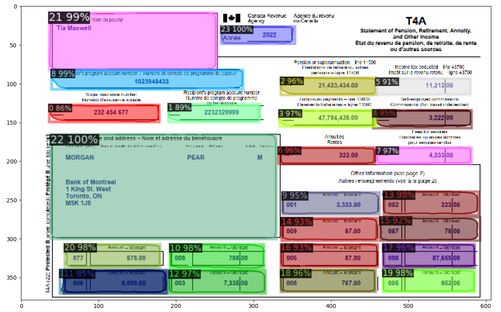

## Instance Segmentation using Detectron2 & Extraction of Forms

- Steps for Installing Detectron2 in Windows
- Clone the Official Repository [Detectron2](https://github.com/facebookresearch/detectron2).

Before getting into the steps, Install Visual Studio Installer 2019 C++ Development Toolkit.


## Step 1: Setup the Detectron2 Environment
``` 
conda create -n detectron_env python=3.8 
conda activate detectron_env 
conda install pytorch torchvision torchaudio pytorch-cuda=10.2 -c pytorch
git clone https://github.com/facebookresearch/detectron2.git
cd detectron2
pip install -e .
pip install opencv-python
```

## Step 2: Annonate your samples using Labelme for Train & test

``` 
pip install labelme
```


## Step 3: Convert the Annotations to COCO Format
``` 
python labelme2coco.py train --output train.json
python labelme2coco.py test --output test.json
```

## Step 4: Train The Model
``` 
python train.py
```

## Step 5: Example Results
```
python test.py
```


